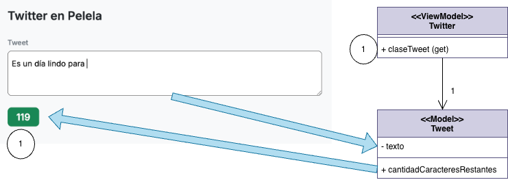

#  Twitter Pelela

[](https://github.com/uqbar-project/eg-twitter-pelela/actions/workflows/ci.yml)

## 🚀 Cómo ejecutarlo

```bash
pnpm install
pnpm dev
```

Abrí tu navegador e ingresá a [http://localhost:5173](http://localhost:5173) para ver la aplicación funcionando en vivo.

---

## El ejemplo

- El usuario escribe dentro del textarea, y eso va actualizando la propiedad `tweet` de nuestro view-model
- Aquí no tenemos un botón, sino propiedades que escuchan cambios en esa propiedad `tweet`...
- ...por lo que la cantidad de caracteres restantes y el color de fondo del span cambian **inmediatamente**

---

## 🔎 Repaso del binding y MVVM

Ya sabés que Pelela trabaja con una tríada en la carpeta `src`. Aquí tenemos

- `twitter.pelela`: Es la vista (HTML) donde definimos nuestros componentes visuales
- `twitter.css`: Los estilos dedicados para este componente
- `twitter.ts`: aquí separamos **el modelo de la vista o view model** (Twitter) y el modelo de negocio, a partir de la clase `Tweet`. Eso nos permite usar vitest para armar tests del tweet sin necesidad de meternos en los tests de frontend, que veremos en la próxima tecnología



## Cobertura de nuestro view model

En este repositorio agregamos un script en el `package.json` para poder conocer la cobertura de nuestros tests unitarios:

```bash
pnpm test:coverage
```

En los ejemplos siguientes nos concentraremos en otros temas, pero resulta bueno saber que una de las ventajas de dividir modelo y vista es que podemos testear el modelo en forma independiente **si nuestro framework de MVC nos permite usar un modelo de objetos agnóstico de la tecnología de vista**.
